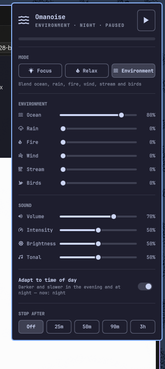

# Omanoise

Procedural concentration soundscapes for the Omarchy shell, in the spirit of
Endel. A small native engine plays sampled acoustic instruments through
libfluidsynth, lays them over wavetable pads it generates at startup with
Paul Nasca's PADsynth algorithm, and mixes the lot with a noise bed and a bank
of six environmental sounds straight into PipeWire — forever and never the same
twice. A bar widget drives it.



Sound engine **v5**. v2 synthesized its musical layer by hand (detuned supersaw
pads, Risset and FM bells, Karplus-Strong plucks, a shimmer bus); it was, in
the author's words, faintly anxiety-inducing. v3 replaced that layer entirely
and removed every source of periodic modulation from the audio path. v4 keeps
Focus exactly as it was, folds the old Sleep mode into Relax, and turns the old
Ocean mode into **Environment**: a bank of blendable environmental sounds over
a tonal layer that is now only a faint background. v5 admits what two attempts
at a synthesized fireplace proved — a convincing fire is not worth synthesizing
— and replaces the fire and wind generators with public-domain and CC0
**recordings**, adding a stream and a dawn chorus alongside them. Ocean and
rain stay synthesized. The reasoning is in `docs/research-opensource.md`, the
specifications in `docs/PLAN-sound-v3.md`, `docs/PLAN-sound-v4.md` and
`docs/PLAN-sound-v5.md`, and the measurements in `docs/ACCEPTANCE.md`.

## Install

```bash
omarchy pkg add fluidsynth soundfont-fluid      # sampled instruments (LGPL / MIT)
omarchy plugin add https://github.com/pepsoren/omanoise --enable
```

Then open the panel from the bar icon and press **Build engine** (or run
`build.sh` in the plugin directory). That compiles the native engine with the
system gcc and PipeWire/FluidSynth headers and converts the bundled
environment recordings to WAV; nothing is downloaded and no sudo is used.
Without the SoundFont the plugin still runs with pads and environments only.

Remove with `omarchy plugin remove io.github.pepsoren.omanoise`; the only file
left behind is the settings file `~/.local/state/omanoise.json`, which you can
delete.

Optional keybinding for `~/.config/hypr/bindings.lua`:

```lua
o.bind("SUPER + SHIFT + N", "Omanoise", "omanoise")
```

## Dependencies

| package | why |
|---|---|
| `pipewire` (+ headers) | audio output |
| `fluidsynth` | sampled instrument playback (LGPL-2.1) |
| `soundfont-fluid` | `/usr/share/soundfonts/FluidR3_GM.sf2`, the sample set (MIT) |
| `gcc` | `./build.sh` |

Without `soundfont-fluid` the engine still runs: it reports `"sf2":false`,
the panel says *Install soundfont-fluid for piano and harp*, and the pads,
bass, noise bed and ocean play on their own. `$OMANOISE_SF2` overrides the
SoundFont path (used by the acceptance tests).

The recorded environments are files in `sounds/`, loaded at startup (about
58 MB of PCM). A missing or unreadable one disables just that slot; everything
else runs. `$OMANOISE_SOUNDS` overrides the directory.

## Layout

```
manifest.json            plugin manifest (bar-widget)
Service.qml              owns the engine process, mirrors its state
Panel.qml                bar icon + popup panel
engine/common.h          constants, RNG, small maths
engine/dsp.[ch]          Cytomic SVF, biquads, delay lines, value-noise drift
engine/padsynth.[ch]     radix-2 FFT + the PADsynth wavetable generator
engine/bank.[ch]         the startup bank: pad tables, bass, pulse one-shots
engine/sf2.[ch]          libfluidsynth: presets, forced attacks, note playback
engine/brain.[ch]        mode profiles, key, chord pool, Markov, voice leading
engine/wav.[ch]          WAV reader + BS.1770 loudness, for the recorded sounds
engine/env.[ch]          the rain generator and the random-segment sample player
engine/layers.c          voices, nature layers, buses, the realtime render loop
engine/fx.[ch]           the Dattorro plate
engine/master.[ch]       HP/AM/width/comp/LP/LUFS-trim/limiter
engine/main.c            PipeWire, stdin protocol, state file, offline renders
build.sh                 one gcc invocation -> bin/omanoise-engine
bin/omanoise-engine      built binary (not tracked; run build.sh)
sounds/*.wav             the recorded environments (see sounds/LICENSES.md)
sounds/src/*.ogg         the originals they were converted from
docs/                    the plans, the research, acceptance runs
```

The engine is started by the plugin and lives as long as the shell does.
It appears in the audio mixer as its own app ("Omanoise"), so the normal
per-app volume works too. Settings persist in `~/.local/state/omanoise.json`.

## Using it

- **Bar icon** 󰋋 — left: panel · right: play/pause · middle: next mode · scroll: volume.
  The icon is accent-coloured while playing and glows with the output level.
- **Panel** — play/pause, three modes, an **Environment** section with one
  slider per environmental sound (shown in Environment mode), Volume /
  Intensity / Brightness / Tonal sliders, neural modulation, binaural beats,
  time-of-day adaptation, focus pulse, and a stop timer.
- **CLI** — `omanoise` (in `~/.local/bin`) wraps the shell IPC:

  ```
  omanoise              toggle play/pause
  omanoise next         cycle modes
  omanoise mode relax   focus | relax | environment
  omanoise env rain 0.6   ocean | rain | fire | wind | stream | birds, 0-1 each
  omanoise volume 0.5
  omanoise timer 45     stop after 45 minutes
  omanoise envonly 1    Environment mode: mute the pad and bass, sounds only
  omanoise sway 1       Environment mode: levels slowly swell and fade
  omanoise swayrate 0.4   0 = a swell every ~8 min, 1 = every ~1 min
  omanoise panel        open/close the popup
  ```

  A keybinding is one line in `~/.config/hypr/bindings.lua`, e.g.

  ```lua
  o.bind("SUPER + SHIFT + N", "Omanoise", "omanoise")
  ```

## Modes

All three are in **major pentatonic** (v2's minor Relax is gone), all events
have attacks of 200 ms or more, and no mode has a shimmer, a chorus, a delay or
a granular layer any more.

| Mode  | Key | Character | Target loudness |
|-------|-----|-----------|-----------------|
| Focus | C major pentatonic | Soft grand piano and vibraphone, ~6 events/min in phrases of 3–6, over a warm PADsynth pad and a quiet pink-brown bed. **Unchanged from v3.** | −21 LUFS |
| Relax | A major pentatonic | Orchestral harp and low piano, single notes and dyads every 7–16 s, a very soft music box now and then, a pad that is now half glass, distant waves, and a broader, darker bed. This is v3's Relax and Sleep merged into one. | −25 LUFS |
| Environment | C major pentatonic | Ocean, rain, fire, wind, stream and birds, each on its own 0–1 slider and all six able to play at once, over a tonal layer 18 dB down — a faint background, not a mode of its own. No melody. | −23 LUFS |

### The Environment bank

Six sounds share one bus: two synthesized, four played from recordings in
`sounds/`. Levels are perceptual (gain goes as level²) and each sound is
calibrated so that it alone at 1.0 lands on the mode's loudness target; the bus
sums them power-preservingly, so four sounds at 0.7 carry the same energy as
one at 1.0. Defaults: ocean 0.8, everything else 0.

| sound | how it is made |
|---|---|
| **Ocean** | Synthesized — the v3 ocean engine, unchanged: three wave engines (a noise rumble through an 85–350 Hz sweep driven by an asymmetric wave envelope, plus a "foam" band lagging 0.8 s behind) on 9–17 s periods that are re-drawn every cycle. |
| **Rain** | Synthesized, Farnell-style. A Poisson patter of 800–1600 impulses/s through a 2-pole band-pass whose centre wanders 350–800 Hz, then LP 3 kHz; and a hiss bed (HP 1.8 kHz, LP 6.5 kHz 4-pole) 16 dB under it with a slow ±3 dB shower envelope. No droplet chirps (they sounded like bubbles) and no resonant whistles. |
| **Fire** | `sounds/fireplace.wav`, 25.5 s, public domain. |
| **Wind** | `sounds/wind.wav`, 14.8 s, CC0. |
| **Stream** | `sounds/stream.wav`, 145.5 s, CC0. |
| **Birds** | `sounds/birds.wav`, 129.8 s, CC0 — a dawn chorus. |

Sources and authors are in `sounds/LICENSES.md`; they come from the
[Blanket](https://github.com/rafaelmardojai/blanket) sound set, converted to
48 kHz 16-bit stereo WAV.

**Why recordings.** Two goes at a synthesized fireplace (v4 and v4.1) were
rejected — the second sounded "like being on the phone with someone with bad
internet in wind and rain". Fire is a famously hard thing to synthesize
convincingly and a public-domain recording is simply the right tool. Wind went
the same way; ocean and rain synthesize well and stayed.

**How a recording is played — never a loop.** Looping a 25 s fire would be
recognisably periodic within a minute. Instead each recorded slot runs two read
heads. A head plays a **randomly chosen segment** of the file at speed 1.0 (no
pitch change: birds and water at altered speed sound wrong); when it has one
crossfade-length left, the other head starts a *new* random segment and the two
cross-fade **equal-power** (sin/cos, so their powers sum to a constant). Segment
lengths and positions are re-drawn every time, so nothing repeats:

| file length | segment | crossfade |
|---|---|---|
| under 40 s | 6–14 s | 2.5 s |
| 40 s and over | 20–45 s | 4 s |

A segment never comes within 1 s of either end of the file, and it is capped at
1/1.7 of the usable span so that two consecutive segments can overlap by no
more than 30 % of their length (for the 14.8 s wind file that caps segments at
7.6 s). Each slot then gets HP 40 Hz, a gentle low-pass at 9 kHz that Brightness
moves ±0.7 octaves, and a ±1.5 dB level drift under 0.05 Hz so a long session
never settles.

**Calibration.** At load time the engine measures each file's loudness twice:
the BS.1770 gated integrated value (the number `ffmpeg -af ebur128` reports)
and the mean of the short-term loudness through the slot's own filters and the
master's stereo width — the statistic the loudness servo actually converges on.
The second one sets the slot's gain, so any file lands near the mode's −23 LUFS
target on its own and the master's auto-trim starts at zero.

**Drop in your own.** Put a 48 kHz 16-bit PCM WAV (mono or stereo) at
`sounds/<slot>.wav` and it replaces that slot — `fireplace.wav`, `wind.wav`,
`stream.wav`, `birds.wav`, and also `ocean.wav` or `rain.wav`, which take over
from the synthesized generators when present. Anything else is rejected with a
line on stderr and the slot reports `"sounds":{"<name>":false}`, which the panel
shows as a dimmed row. `$OMANOISE_SOUNDS` overrides the directory.

Nothing in the bank is periodic: every envelope is value noise at 0.02–0.2 Hz,
every event train is a Poisson process, and the recorded players schedule
random segments of random length.

With **Adapt to time of day** on, evenings and nights darken the filters and
drop the key by 2 / 5 semitones; mornings are a touch brighter.

The **focus pulse** and the **16 Hz neural modulation** are now **off by
default** (both are periodic modulation; see below). They are still toggles.

## How the sound is built

Everything runs at 48 kHz, stereo.

1. **Startup, in a worker thread** (~100 ms for the tables, ~40 ms for the
   SoundFont, ~10 MB of tables):
   - Four **PADsynth** wavetables, 2^18 samples (5.46 s) each, tuned to 220 Hz:
     a *warm* profile (A_n = 1/n^1.6, odd harmonics favoured) and a *glass*
     profile (A_n = 1/n^2.4 with a bump on the 2nd and 3rd), two independent
     random-phase tables per profile. Each partial is a Gaussian band rather
     than a line, so the pad is lush without a single detuned oscillator
     anywhere — nothing beats. The left channel reads one table of a profile
     and the right the other: full stereo width, identical spectra, no pitch
     difference at all. Built with an FFT written for this engine (no FFTW).
   - **FluidR3_GM** loaded through libfluidsynth with reverb and chorus off,
     `synth.threadsafe-api 0` (all synth calls happen on the audio thread) and
     `synth.dynamic-sample-loading 1`. Four presets are selected here, in the
     worker, because preset selection is what pages sample data in; after that
     `fluid_synth_noteon` never touches the disk.
   - A saw+sub **bass** and the two **pulse** one-shots, as before.
2. **The brain** (control rate, every 64 samples) — one key per mode, a pool of
   four wide add9/6/sus chords moving every 1–3 minutes through a Markov table
   biased toward common tones. Sustaining voices are **snapped to just
   intervals** above the key root, so where two chord tones share a harmonic it
   coincides exactly instead of beating at a few hertz, and below 250 Hz no two
   voices are allowed closer than an octave (Plomp & Levelt: a fifth down there
   sits inside one critical band). Melody notes come from a Markov chain over
   the five pentatonic degrees with steps strongly favoured over leaps.
3. **Pads** — four voices on incommensurate Eno periods (17.3 / 21.9 / 26.1 /
   31.7 s, mode-scaled), 4–6 s raised-cosine attack and 8–12 s release, each
   re-voiced at the top of its own cycle and sometimes sitting a whole cycle
   out (never more than two of four). Per-voice keytracked low-pass at
   1.6–2.5 × f0, drifted by value noise at about 0.05 Hz. No chorus, no
   waveshaper.
4. **Melody** — `fluid_synth_noteon` on four channels: Acoustic Grand Piano (0),
   Orchestral Harp (46), Vibraphone (11) and Music Box (10). Every channel gets
   a volume-envelope-attack generator that stretches its onset to 200–1160 ms
   measured (the startle threshold is 12 ms and 141–220 ms mitigates it fully),
   a filter-cutoff offset for darkness, and an attenuation offset that matches
   the four instruments to each other. Velocities are 28–62, never accented;
   events are at least 1.5 s apart. Melody events duck the pad bus by up to
   2.5 dB.
5. **Nature** — a brown/pink bed low-passed at 0.9–2.8 kHz, plus the ocean
   engines described above: a quiet bed inside Relax, and in Environment the
   first of the six blendable sounds, where the whole bank also feeds the
   plate at −14 dB (−18 dB for stream and birds, whose recordings already carry
   their own room). Each wave keeps a floor under it so distant surf never
   stops, and the three periods (about 9, 12 and 15 s, re-drawn every cycle)
   never line up.
6. **Space** — one Dattorro plate (scaled ×1.61 to 48 kHz, 40 ms pre-delay,
   decay ≤ 0.90, damping 2.5–3.5 kHz), its input high-passed at 200 Hz. The
   tank allpasses are de-fluttered by two slow value-noise drifts instead of
   the paper's 0.7 Hz sine, because v3 allows no periodic modulation in the
   audio path.
7. **Master** — HP 30 Hz → optional 16 Hz amplitude modulation on the
   200 Hz–1 kHz band (Focus only, **off by default**, depth capped at 0.35) →
   M/S width 1.3 with the side high-passed at 200 Hz → 1.5:1 bus compression →
   gentle 9 kHz roll-off → a BS.1770 K-weighted loudness meter driving a slow
   ±6 dB trim toward the mode's LUFS target → volume² → a 5 ms look-ahead soft
   limiter.

Denormals are flushed on the audio thread, all delay buffers are powers of two
and the realtime thread never allocates, locks or prints (FluidSynth's global
log handlers are replaced with no-ops for exactly that reason). Measured cost
and memory are in `docs/ACCEPTANCE.md` (§v3-7 and the v4 section).

## Engine protocol

Plain text on stdin, one command per line; every change is echoed as
`state {json}` on stdout, plus `meter <rms>` ten times a second while playing.
Unsolicited `state` lines are emitted when the wavetable bank finishes
(`"bank"` → `true`) and when the SoundFont finishes (`"sf2"` → `true`).

```
play | pause | toggle | quit | state
mode focus|relax|environment        (sleep -> relax, ocean/env -> environment)
volume|intensity|brightness|tonal <0..1>
env ocean|rain|fire|wind|stream|birds <0..1>
binaural|adaptive|pulse|modulation 0|1
envonly|sway 0|1                    (Environment mode only)
swayrate <0..1>                     (sway period, 8 min .. 1 min)
```

`state` JSON fields: `version` (5), `playing`, `mode`, `volume`, `intensity`,
`brightness`, `tonal`, `binaural`, `adaptive`, `pulse`, `modulation`,
`envonly`, `sway`, `swayrate`,
`env` (an object with the six level keys), `sounds` (the same six keys, `true`
when the slot can make a sound — the synthesized ones always, a recorded one
once its WAV has loaded), `daypart`, `bank`, `sf2`, `lufs` (short-term
K-weighted loudness).

Migrations are one-way and silent. A file written by v2 has no `version` key;
`modulation` and `pulse` are forced off once, because both are periodic
modulation. A v3 file names modes `sleep` and `ocean`; those resolve to `relax`
and `environment` and the default `env` object is added. A v4 file gains
`stream` and `birds` at 0. In every case the file is rewritten with
`"version":5`. The old mode names keep working as commands for ever.

Offline, for testing without PipeWire:

```
omanoise-engine --render <mode> <seconds> <out.f32> [--tail <seconds>] [--stats] [--layers <mask>] [--env name=v,...]
omanoise-engine --render-bank <dir>
```

`--tail` keeps rendering with playback paused, so reverb tails can be checked
for clean decay. `--stats` prints event counts, peak, DC, the largest
sample-to-sample step, the **segment log** of every recorded slot that played
(each entry is `position+length` in seconds, which is how the acceptance run
shows the scheduling is random), and the **roughness metric**: the output envelope
(|x| → four one-poles at 100 Hz → decimated to 400 Hz) is transformed with the
PADsynth FFT and reported as `FLUCT` (energy in 1–8 Hz, where fluctuation
strength peaks) and `ROUGH` (15–200 Hz, the roughness band), both in dB
relative to the envelope's mean. `OMANOISE_ENVPROF=1` adds the whole envelope
spectrum in octave bands. `--layers` is a debug mask (1 = pads, bass and the
noise bed; 2 = melody and pulse; 4 = the environment bank, the ocean bed and
the 16 Hz modulation; 7 = everything). `--env ocean=1,rain=0.5` overrides the
persisted environment levels for one render. The plate and the master chain always run. `--render-bank` writes every wavetable and one soft note per
instrument as raw mono f32 and prints each one's attack time, peak and spectral
centroid.

## Evidence notes

**Neural modulation** (16 Hz AM on the low-mids, Focus only) is the one "neuro"
feature here with peer-reviewed support — Woods et al. 2024 found EEG
phase-locking at 16 Hz and a behavioural benefit concentrated in listeners with
high ADHD-symptom scores. It is nevertheless **off by default**: 16 Hz is
inside the 15–300 Hz roughness band, and this build's whole premise is that
periodic modulation in that range is what made v2 uncomfortable. **Binaural
beats** are off by default too: the meta-analytic picture is weak and mixed.
See `docs/research-science.md` and `docs/research-opensource.md`.
